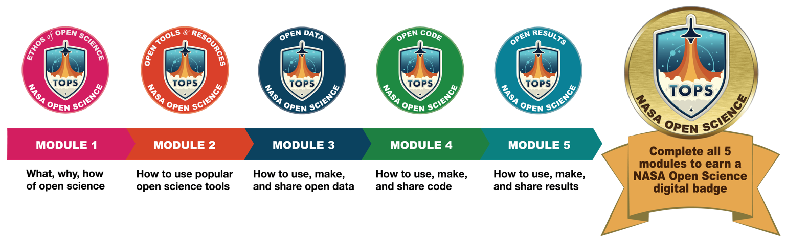

# Open Science 101 Curriculum

## Curriculum Overview

Transform to Open Science (TOPS) is a NASA initiative designed to rapidly transform agencies, organizations, and communities to an inclusive culture of open science. Developed by the TOPS initiative, the guidance provided by the Open Science 101 curriculum will promote the transformation of the research landscape and the accompanying advancement of scientific discovery. The Open Science 101 curriculum aims to introduce learners to a nuanced understanding of open science, enabling participants to better understand an open science workflow from end to end. The focus of the curriculum will be on providing learners with a basic understanding of open science, its ethos and benefits, and how to actively participate in open science communities. The TOPS curriculum will also be used to support researchers looking to engage with NASA as NASA moves to adopt more open science requirements. Scientists will need to acquire the new skills highlighted in the curriculum to participate in open science effectively and to demonstrate those skills when applying for NASA funding opportunities.

## Open Science Curriculum: Open Science 101 

### 5 Modules Organized as a Scientific Workflow



A NASA Open Science digital badge is earned by completing all five modules and passing the assessment at the end of each module.

## Navigation

```{tableofcontents}
```

### [Module 1 - The Ethos of Open Science](./Module_1/readme.md)
* [Lesson 1: What is Open Science?](./Module_1/Lesson_1/readme.md)
* [Lesson 2: Why is Open Science Important?](./Module_1/Lesson_2/readme.md)
* [Lesson 3: How to do Open Science](./Module_1/Lesson_3/readme.md)
* [Lesson 4: When Not to be Open](./Module_1/Lesson_4/readme.md)
* [Lesson 5: Planning for Open Science: From Theory to Practice](./Module_1/Lesson_5/readme.md)

### [Module 2 - Open Tools & Resources](./Module_2/readme.md)
* [Lesson 1: Introduction to the Process of Open Science](./Module_2/Lesson_1/readme.md)
* [Lesson 2: General Tools for Open Science](./Module_2/Lesson_2/readme.md)
* [Lesson 3: Tools for Open Data](./Module_2/Lesson_3/readme.md)
* [Lesson 4: Tools for Open Code](./Module_2/Lesson_4/readme.md)
* [Lesson 5: Tools for Open Results](./Module_2/Lesson_5/readme.md)

### [Module 3 - Open Data](./Module_3/readme.md)
* [Lesson 1: Introduction to Open Data](./Module_3/Lesson_1/readme.md)
* [Lesson 2: Using Open Data](./Module_3/Lesson_2/readme.md)
* [Lesson 3: Making Open Data](./Module_3/Lesson_3/readme.md)
* [Lesson 4: Sharing Open Data](./Module_3/Lesson_4/readme.md)
* [Lesson 5: From Theory to Practice](./Module_3/Lesson_5/readme.md)

### [Module 4 - Open Code](./Module_4/readme.md)
* [Lesson 1: Introduction to Open Code](./Module_4/Lesson_1/readme.md)
* [Lesson 2: Using Open Code](./Module_4/Lesson_2/readme.md)
* [Lesson 3: Making Open Code](./Module_4/Lesson_3/readme.md)
* [Lesson 4: Sharing Open Code](./Module_4/Lesson_4/readme.md)
* [Lesson 5: From Theory to Practice](./Module_4/Lesson_5/readme.md)

### [Module 5 - Open Results](./Module_5/readme.md)
* [Lesson 1: Introduction to Open Results](./Module_5/Lesson_1/readme.md)
* [Lesson 2: Using Open Results](./Module_5/Lesson_2/readme.md)
* [Lesson 3: Making Open Results](./Module_5/Lesson_3/readme.md)
* [Lesson 4: Sharing Open Results](./Module_5/Lesson_4/readme.md)
* [Lesson 5: From Theory to Practice](./Module_5/Lesson_5/readme.md)